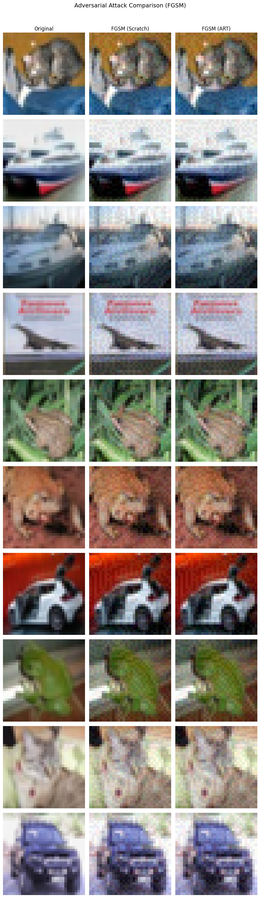
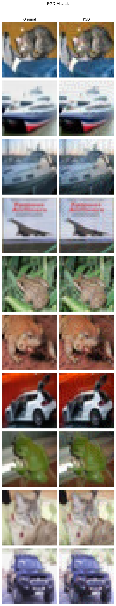
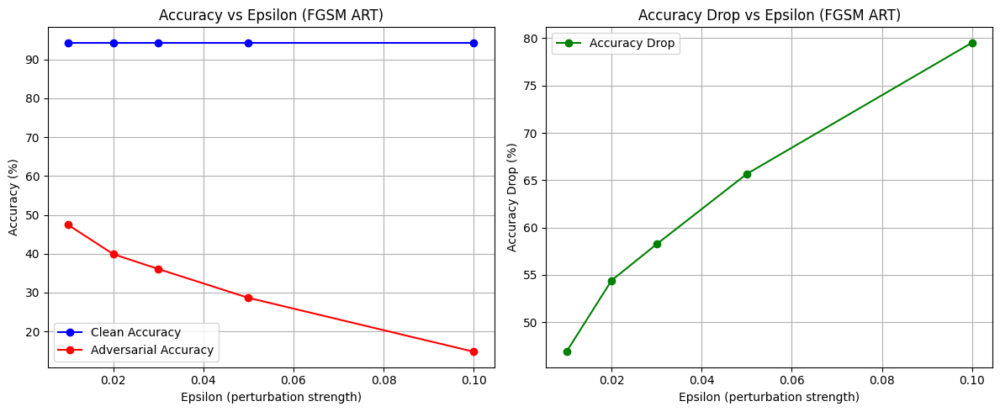
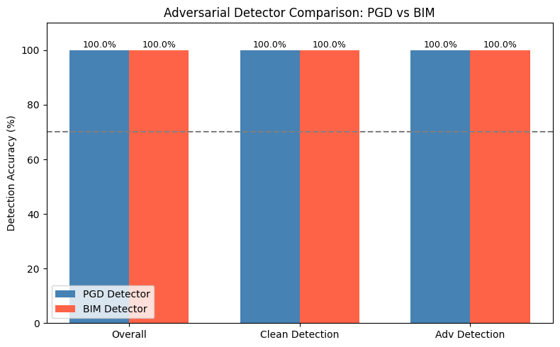

# Q2 — Adversarial Attacks using IBM ART

## Setup

```bash
pip install -r requirements.txt
wandb login   # paste your API key from wandb.ai/authorize
```

## Run Order

### Step 1 — Train ResNet18 classifier on CIFAR-10
```bash
python train_classifier.py --epochs 50
```
Target: ≥72% test accuracy. Saves `weights/resnet18_best.pth`.

### Step 2 — Generate adversarial images (FGSM scratch, FGSM ART, PGD, BIM)
```bash
python generate_attacks.py --weights ./weights/resnet18_best.pth
```
Saves `.npy` arrays in `data/`. Also saves visual comparison plots.

### Step 3 — Train adversarial detectors (ResNet34)
```bash
python train_detector.py
```
Trains PGD detector + BIM detector. Target: ≥70% detection accuracy each.

### Step 4 — Final evaluation + WandB report
```bash
python evaluate.py
```

## Docker

```bash
docker build -t dlops-q2 .
docker run --gpus all -v $(pwd)/weights:/app/weights -v $(pwd)/data:/app/data dlops-q2 python train_classifier.py --epochs 50
```

---

## Results

### Part (i) — ResNet18 Classifier on CIFAR-10

| Metric | Value |
|--------|-------|
| Architecture | ResNet18 (from scratch, no pretrained weights) |
| Dataset | CIFAR-10 |
| Epochs | 50 |
| Optimizer | SGD + Nesterov (lr=0.1, CosineAnnealingLR) |
| Best Val Accuracy | **94.31%** |
| Train Accuracy | 99.88% |

---

### Part (i) — Adversarial Attack Results (ε = 0.03)

| Attack | Clean Acc | Adv Acc | Drop |
|--------|-----------|---------|------|
| No Attack | 94.31% | 94.31% | 0.00% |
| FGSM (Scratch) | 94.31% | 32.77% | 61.54% |
| FGSM (ART) | 94.31% | 36.07% | 58.24% |
| PGD (ART) | 94.31% | 3.45% | **90.86%** |
| BIM (ART) | 94.31% | 3.90% | **90.41%** |

### Part (i) — Epsilon Sweep (FGSM ART)

| Epsilon | Clean Acc | Adv Acc | Drop |
|---------|-----------|---------|------|
| 0.010 | 94.31% | 47.43% | 46.88% |
| 0.020 | 94.31% | 39.90% | 54.41% |
| 0.030 | 94.31% | 36.07% | 58.24% |
| 0.050 | 94.31% | 28.65% | 65.66% |
| 0.100 | 94.31% | 14.78% | 79.53% |






---

### Part (ii) — Adversarial Detector Results (ResNet34)

| Detector | Overall Acc | Clean Detection | Adv Detection | Status |
|----------|-------------|-----------------|---------------|--------|
| PGD Detector | **99.97%** | 100.00% | 99.95% | PASS |
| BIM Detector | **99.97%** | 99.95% | 100.00% | PASS |



---

## WandB
https://wandb.ai/m25csa018-iit-j/dlops-q2-adversarial

## HuggingFace
[Link to be added]
